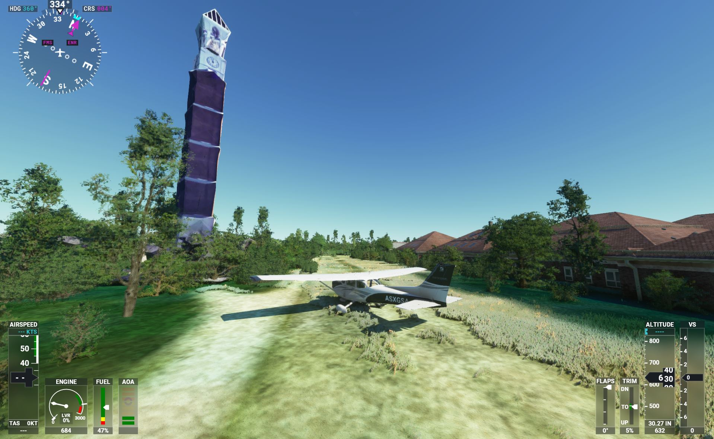

# Purdue Bell Tower in Microsoft Flight Simulator 2020

The Purdue Bell Tower was not included in the default Bing 3D photogrammetry. This package is a 3D model imported from Google Maps, processed in Blender, and exported for MSFS.

## Installation

Download the [latest release](https://github.com/aharonhannan/msfs-purdue-bell-tower/releases) and unzip the downloaded file.

If no addon manager is installed, copy the folder `purduebelltower` into the community folder under the FS2020 packages folder. The folder is located under:
- Microsoft Store Edition:
`C:\Users\[YOUR USERNAME]\AppData\Local\Packages\Microsoft.FlightSimulator_<RANDOMLETTERS>\LocalCache\Packages\Community`

- Steam Edition:
`C:\Users\[YOUR USERNAME]\AppData\Roaming\Microsoft Flight Simulator\Packages\Community`

- Boxed Edition:
`C:\Users\[YOUR USERNAME]\AppData\Local\MSFSPackages\Community`

- Or in the Community folder under Options > General > Data > Rolling Cache Path set location.

## Time for Takeoff

Fly out of Purdue University (KLAF) and let the bell tower help you find your way!

## The Bell Tower Curse

While walking underneath the bell tower is strongly discouraged, I definitely do not recommend trying to fly under it.

## Other Information

The bell tower was created with the help of Google Maps, [RenderDoc](https://renderdoc.org), and [Blender](https://www.blender.org/), converted with the Blender Plugins: [Blender2MSFS](https://www.fsdeveloper.com/forum/resources/blender2msfs-toolkit.256/) and [MapsModelImporter](https://github.com/eliemichel/MapsModelsImporter). Shoutout to YouTuber [Flying Theston](https://www.youtube.com/watch?v=ZdCP11rqpVk) for providing a great video on importing these models to MSFS. 

Enjoy, and Boiler Up!
